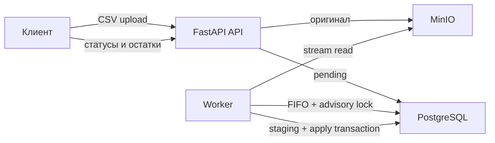

# Архитектура сервиса импорта остатков

## 1. Цель и границы

Нужно реализовать проверяемый backend-сервис, который принимает CSV-отчёты с остатками, сохраняет оригиналы в MinIO, валидирует данные и атомарно синхронизирует остатки в PostgreSQL.

Главный приоритет тестового задания — корректность. Поэтому отчёты обрабатываются последовательно одним логическим worker, а PostgreSQL используется и как БД, и как простая очередь. Redis, Celery, Kafka и другие инфраструктурные компоненты не нужны.

Этот документ описывает план. Код приложения и бизнес-логика на текущем этапе не создаются.

## 2. Основное решение

- FastAPI API принимает файл и сохраняет его в MinIO частями, не загружая целиком в память.
- После успешного сохранения оригинала API создаёт в PostgreSQL отчёт со статусом `pending`.
- Отдельный worker выбирает отчёты из PostgreSQL по `created_at ASC, id ASC`.
- Worker читает объект из MinIO потоково и сохраняет проверенные строки в постоянную staging-таблицу пакетами.
- До завершения проверки всего файла таблицы складов, товаров и остатков не изменяются.
- После успешной проверки весь снимок применяется одной транзакцией PostgreSQL.
- Несколько worker-процессов координируются session-level advisory lock, поэтому фактически работает один обработчик.
- При ошибке применения предметная транзакция откатывается, а `failed` и причина ошибки сохраняются отдельной транзакцией.
- Оригинальный файл сохраняется для `completed` и `failed`.



## 3. Функциональные требования

### Загрузка и отчёты

- Принимать CSV-файл размером до `1_073_741_824` байт.
- Сохранять точные исходные байты в MinIO.
- Создавать отдельный отчёт для каждой принятой загрузки.
- Хранить статус, даты начала/завершения, число строк, ошибок и применённых изменений.
- Не удалять оригинал из-за ошибки структуры, данных или применения.
- Позволять скачать оригинал при любом бизнес-статусе.

### Валидация CSV

- Принимать UTF-8 и UTF-8 BOM, заголовок и разделитель `,`.
- Требовать колонки `warehouse_code`, `warehouse_name`, `sku`, `product_name`, `quantity`.
- Требовать непустые коды и названия.
- Требовать целое `quantity >= 0` в диапазоне PostgreSQL `BIGINT`.
- Запрещать повтор пары `warehouse_code + sku` в одном отчёте.
- Разрешать разные `warehouse_name` для одного `warehouse_code` и разные `product_name` для одного `sku`.
- При применении выбирать название из строки с максимальным `line_number`, то есть из последней логической CSV-строки для соответствующего кода.
- Сохранять ошибки в БД: номер строки, поле, код/описание и исходные данные строки, если применимо.
- При любой ошибке не применять отчёт целиком.

### Применение снимка

- Создавать отсутствующие склады и товары.
- Обновлять названия существующих складов и товаров.
- Создавать или обновлять остаток для каждой пары из CSV.
- Для каждого склада, присутствующего в отчёте, ставить `0` существующим остаткам пар, отсутствующих в CSV.
- Не менять остатки складов, отсутствующих в отчёте.
- Хранить нулевые остатки строками, а не удалять их.
- Применять склады, товары, остатки, обнуление и статус `completed` атомарно.

### API и наблюдаемость

- Предоставлять список и детали отчётов, ошибки отчёта и скачивание оригинала.
- Предоставлять списки складов и товаров.
- Предоставлять остатки с фильтрами по складу и/или товару.
- Пагинировать списки.
- Логировать загрузку, начало обработки, успешное завершение, validation error и processing error с `report_id`.

## 4. Нефункциональные требования

- API и worker не загружают CSV целиком в память.
- Чтение S3 выполняется фиксированными блоками, запись staging и ошибок — ограниченными пакетами.
- Размер проверяется по фактически прочитанным байтам, а не только по `Content-Length`.
- Результат нескольких отчётов детерминирован строгим FIFO среди зарегистрированных отчётов.
- Читатели PostgreSQL видят состояние до или после финальной транзакции, но не частично применённый снимок.
- Проект запускается в Linux через Docker Compose.
- Схема создаётся Alembic-миграциями.
- Все timestamps timezone-aware и выдаются в UTC.
- Основные правила покрыты unit- и integration-тестами с реальными PostgreSQL и MinIO.

## 5. Компоненты

### API

Ответственность API:

1. принять `multipart/form-data` с полем `file`;
2. потоково передать файл в MinIO и проверить фактический размер;
3. после успешной загрузки создать `reports(status=pending)`;
4. вернуть `202 Accepted` и идентификатор отчёта;
5. обслуживать read endpoints и потоковое скачивание оригинала.

API не разбирает CSV и не изменяет предметные таблицы. FastAPI `UploadFile` может временно spool-ить большой multipart-файл на диск, но endpoint читает его только блоками. Для локального запуска нужно предусмотреть достаточно места во временном каталоге.

Между S3 и PostgreSQL нет общей транзакции. Если S3 upload завершился, а создание отчёта не удалось, API пытается удалить только что созданный незарегистрированный объект. Зарегистрированные объекты, включая `failed`, не удаляются.

### Worker

Worker:

1. получает session-level PostgreSQL advisory lock на выделенном соединении;
2. выбирает самый ранний `pending` по `created_at, id`;
3. переводит его в `processing`;
4. читает CSV из MinIO и пишет staging/errors пакетами;
5. при успешной проверке запускает одну apply-транзакцию;
6. при validation error сохраняет `failed` без запуска apply;
7. после терминального статуса очищает staging отчёта.

Если процесс упал со статусом `processing`, новый worker после получения lock начинает этот отчёт заново: удаляет его незавершённый staging и ошибки предыдущей попытки, затем повторно читает оригинал. Более новый отчёт не обгоняет прерванный.

### PostgreSQL

PostgreSQL хранит отчёты, ошибки, staging, склады, товары и остатки. Ограничения БД страхуют уникальные коды, уникальные пары и неотрицательные количества.

### MinIO

MinIO хранит неизменяемые оригиналы. Внутренний object key генерируется сервисом и не строится напрямую из пользовательского имени файла.

## 6. Модель данных

### `reports`

| Поле | Тип | Назначение |
|---|---|---|
| `id` | `BIGINT IDENTITY` | Primary key и второй ключ FIFO |
| `status` | `VARCHAR` | `pending`, `processing`, `completed`, `failed` |
| `original_filename` | `TEXT` | Исходное имя для скачивания |
| `object_bucket` | `TEXT` | Bucket MinIO |
| `object_key` | `TEXT` | Уникальный ключ объекта |
| `size_bytes` | `BIGINT` | Фактический размер файла |
| `created_at` | `TIMESTAMPTZ` | Момент регистрации после upload |
| `processing_started_at` | `TIMESTAMPTZ NULL` | Начало обработки |
| `finished_at` | `TIMESTAMPTZ NULL` | Завершение |
| `row_count` | `BIGINT` | Число data-строк без header |
| `error_count` | `BIGINT` | Число ошибок |
| `stocks_created` | `BIGINT` | Новые пары склад–товар |
| `stocks_updated` | `BIGINT` | Явные существующие пары с изменившимся quantity |
| `stocks_zeroed` | `BIGINT` | Неявно обнулённые ненулевые пары |
| `failure_kind` | `VARCHAR NULL` | `validation` или `processing` |
| `failure_message` | `TEXT NULL` | Краткая причина ошибки |

Ограничения: обязательные поля `NOT NULL`, счётчики `DEFAULT 0 CHECK >= 0`, CHECK статуса, UNIQUE `(object_bucket, object_key)`. Индексы: очередь `(created_at, id)` для нетерминальных статусов и список `(created_at DESC, id DESC)`.

### `report_errors`

- `id BIGINT IDENTITY PRIMARY KEY`;
- `report_id BIGINT NOT NULL`, FK на `reports`;
- `line_number BIGINT NULL`;
- `field_name TEXT NULL`;
- `code TEXT NOT NULL`;
- `message TEXT NOT NULL`;
- `raw_data JSONB NULL`;
- `created_at TIMESTAMPTZ NOT NULL`.

Ошибки файла/header/application могут не иметь строки или поля. Индекс: `(report_id, line_number, id)`.

### `report_staging_rows`

- `report_id BIGINT NOT NULL`, FK на `reports`;
- `line_number BIGINT NOT NULL`;
- `warehouse_code TEXT NOT NULL`;
- `warehouse_name TEXT NOT NULL`;
- `sku TEXT NOT NULL`;
- `product_name TEXT NOT NULL`;
- `quantity BIGINT NOT NULL CHECK quantity >= 0`;
- primary key `(report_id, line_number)`;
- индекс `(report_id, warehouse_code, sku)`.

Пара кодов намеренно не UNIQUE в staging: после чтения всего файла SQL-запрос находит все дубликаты и формирует понятные ошибки.

### `warehouses`

- `id BIGINT IDENTITY PRIMARY KEY`;
- `code TEXT NOT NULL UNIQUE`;
- `name TEXT NOT NULL`;
- `created_at`, `updated_at TIMESTAMPTZ NOT NULL`.

### `products`

- `id BIGINT IDENTITY PRIMARY KEY`;
- `sku TEXT NOT NULL UNIQUE`;
- `name TEXT NOT NULL`;
- `created_at`, `updated_at TIMESTAMPTZ NOT NULL`.

### `stock_balances`

- `warehouse_id BIGINT NOT NULL`, FK на `warehouses`;
- `product_id BIGINT NOT NULL`, FK на `products`;
- `quantity BIGINT NOT NULL CHECK quantity >= 0`;
- `created_at`, `updated_at TIMESTAMPTZ NOT NULL`;
- primary key `(warehouse_id, product_id)`;
- индекс `(product_id, warehouse_id)` для фильтра по товару.

## 7. API endpoints

Префикс: `/api/v1`.

| Метод и путь | Назначение |
|---|---|
| `POST /reports` | Загрузить CSV; ответ `202` с отчётом `pending` |
| `GET /reports` | Список отчётов; фильтры `status`, `limit`, `offset` |
| `GET /reports/{id}` | Статус, даты, счётчики и итоговая ошибка |
| `GET /reports/{id}/errors` | Пагинированные ошибки отчёта |
| `GET /reports/{id}/original` | Потоково скачать исходный файл |
| `GET /warehouses` | Список складов |
| `GET /products` | Список товаров |
| `GET /stocks` | Остатки; фильтры `warehouse_code`, `sku`, `limit`, `offset` |

Правила API:

- Неверный CSV не отклоняется upload endpoint: оригинал принимается, затем отчёт становится `failed`.
- `413` используется при превышении лимита; такой отчёт не регистрируется.
- Неизвестный идентификатор даёт `404`.
- Недоступность PostgreSQL/MinIO даёт понятную `503` или `500` с безопасным сообщением.
- Внутренний bucket/key не возвращается публично.
- Списки сортируются явно и имеют ограниченный `limit`.

## 8. Жизненный цикл

```text
S3 upload завершён
    -> pending
    -> processing
       -> completed
       -> failed
```

- `pending -> processing`: worker забрал самый ранний отчёт.
- `processing -> completed`: применённый снимок и статус закоммичены одной транзакцией.
- `processing -> failed`: validation error либо processing error после rollback.
- Прерванный `processing` повторно обрабатывается с начала под advisory lock.

Пока S3 upload не завершён и запись `pending` не создана, отчёт не считается принятым системой.

## 9. Алгоритм потоковой валидации

1. Открыть объект MinIO как поток и декодировать `utf-8-sig` с ошибками декодирования как validation error.
2. Создать стандартный CSV reader с разделителем `,`.
3. Проверить header: обязательные имена присутствуют ровно один раз; дополнительные колонки разрешены и игнорируются.
4. Для каждой логической записи:
   - увеличить `row_count`;
   - проверить число полей;
   - удалить внешние пробелы у используемых значений;
   - проверить непустые коды/названия;
   - проверить десятичное целое `quantity >= 0`;
   - сохранить ошибки строки;
   - корректную строку добавить в ограниченный staging batch.
5. Записывать staging и ошибки batch-ами, не накапливая весь файл в Python.
6. После EOF SQL-запросом проверить дубли `(warehouse_code, sku)`. Различающиеся названия одного склада или товара ошибкой не являются.
7. Если есть ошибки, выставить `failed`; предметные таблицы не открывать для записи.
8. Если ошибок нет, перейти к apply-транзакции.

Номер строки — номер логической CSV-записи: header имеет номер 1, первая data-строка — 2. Пустой файл и файл только с header считаются невалидными.

## 10. Алгоритм атомарного применения

В одной транзакции PostgreSQL:

1. Заблокировать строку отчёта и убедиться, что она всё ещё `processing` и ошибок нет.
2. Set-based SQL-запросом сформировать источник складов: по каждому `warehouse_code` выбрать `warehouse_name` из строки с максимальным `line_number`, затем создать или обновить склады.
3. Set-based SQL-запросом сформировать источник товаров: по каждому `sku` выбрать `product_name` из строки с максимальным `line_number`, затем создать или обновить товары.
4. До изменения остатков вычислить счётчики `created` и `updated`.
5. Создать или обновить явные пары из CSV.
6. Для складов текущего отчёта обновить до `0` существующие ненулевые пары, отсутствующие в staging, и посчитать `zeroed`.
7. Не менять склады, отсутствующие в отчёте.
8. Обновить отчёт до `completed`, записать `finished_at` и счётчики.
9. Закоммитить транзакцию.

Источники upsert складов и товаров обязательно формируются set-based, например через `DISTINCT ON (...) ... ORDER BY ... line_number DESC` или оконную функцию `row_number()`. Это гарантирует ровно одну строку на код и детерминированно выбирает последнее название.

Определение счётчиков:

- `created` — пары, которых до применения не было;
- `updated` — присутствующие в CSV существующие пары, quantity которых реально изменилось;
- `zeroed` — отсутствующие в снимке представленного склада пары, которые изменились с ненулевого значения на `0`;
- неизменившиеся пары не считаются обновлёнными.

Если любой шаг завершается ошибкой, транзакция откатывается. После rollback новая короткая транзакция сохраняет processing error и `failed`. Staging очищается после фиксации терминального результата и не влияет на атомарность предметных данных.

## 11. Конкурентная обработка

Worker открывает выделенное PostgreSQL-соединение и вызывает `pg_try_advisory_lock` с фиксированным ключом.

- Получивший lock worker выбирает самый ранний зарегистрированный нетерминальный отчёт по `created_at, id`.
- Не получивший lock worker ничего не обрабатывает и повторяет попытку позже.
- Lock удерживается, пока текущий отчёт не станет `completed` или `failed`.
- Затем lock явно освобождается.
- `SKIP LOCKED` не используется: более ранний отчёт нельзя пропускать.
- Если lock-соединение потеряно, worker прекращает текущую попытку и не продолжает запись через новое соединение. Новый worker восстановит `processing` с начала.

Такой подход намеренно сериализует даже непересекающиеся отчёты. Для тестового задания это проще всего проверить и достаточно для детерминированного результата.

## 12. Неоднозначности и принятые решения

| Вопрос | Решение |
|---|---|
| «1 ГБ» | `1_073_741_824` байт |
| Дополнительные колонки | Разрешены и игнорируются |
| Пробелы | Удаляются по краям используемых значений |
| Регистр кодов/SKU | Сравнение case-sensitive |
| Разные названия одного склада или товара внутри файла | Допустимы; при upsert используется значение из строки с максимальным `line_number` |
| Пустой/header-only файл | `failed` после сохранения оригинала |
| Пустой склад | Формат не позволяет представить склад без товарной строки |
| Повтор одинакового файла | Новый независимый отчёт |
| Явный ноль | Допустим и сохраняется |
| Авторизация | Не входит в тестовое задание |
| Удаление отчётов/retention | Не входит в тестовое задание |

## 13. Ключевые риски

- S3 и PostgreSQL не имеют общей транзакции; нужен простой best-effort cleanup незарегистрированного объекта.
- `UploadFile` может использовать временный диск для большого multipart upload; Docker-среде нужен достаточный объём.
- Большой staging увеличивает объём PostgreSQL и время обработки; нужны batch insert и индексы только по используемым запросам.
- Глобальный advisory lock создаёт head-of-line blocking, но это осознанная плата за простой FIFO.
- CSV не может выразить полностью пустой склад, поэтому такой snapshot требует будущего расширения формата.
